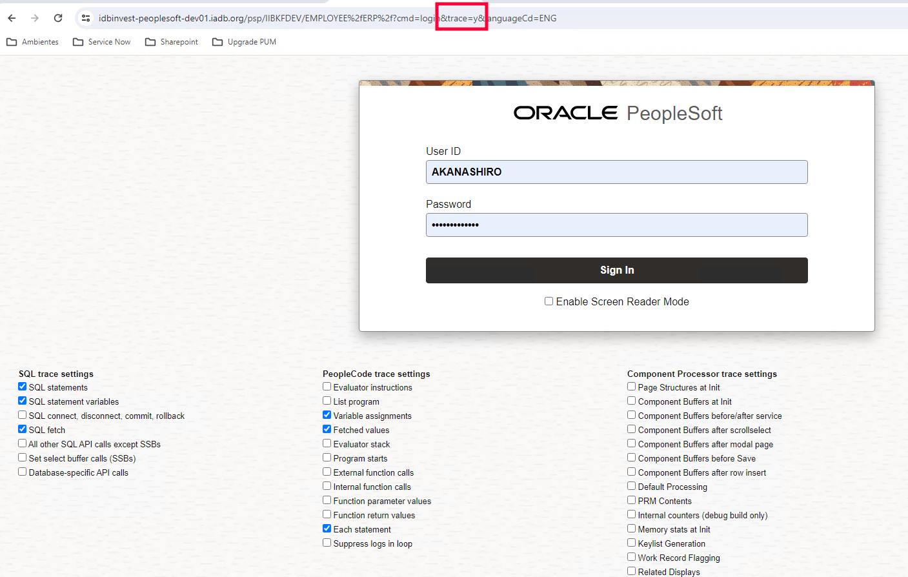

# Establecer trace en el login
En la pantalla se puede elegir *"Set Trace Flags"* o en la url colocar ```&trace=y```

Recomiendo marcar las siguientes opciones para tener un trace legible completo pero sin exceso de información.

