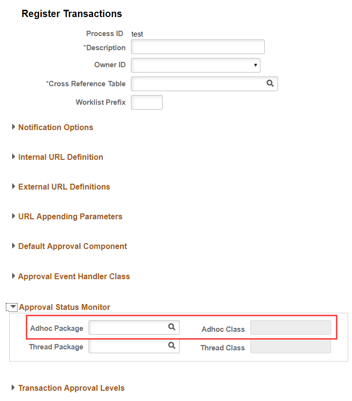

# How to allow AdHoc Approver in AWE 
The most difficult part about modeling an approval workflow is all the possible scenarios and conditions to handle. Sometimes there are exceptions to the rule that are not easy to design because the client has a special behavior in the approval workflow.

E.g.: certain approver is absent or could not approve the step on time (there is a timeout). So a special user could have the ability to modify ("bend") the current approval workflow in this special case. This is called adhoc approver.

There are a lot posts and documents about this subject but I wanted to make a simpler and more straightforward example.

In this case, AWE will grant a user the ability to modify the workflow if that user has enough permissions to do that (an specific role called "WorkFlowAdmin").

First, you must create an custom application package to handle this feature. The package will re-implement some methods (you don't have to re-implement all, just what you need).

It basically queries if the user is watching the workflow, can insert/delete a step (approver) or create a new path

```
import EOAW_MONITOR:ADHOC_OBJECTS:adhocAccessLogicBase;
import EOAW_CORE:ENGINE:StepInst;
import EOAW_CORE:ENGINE:StageInst;


class customAdHocClass extends EOAW_MONITOR:ADHOC_OBJECTS:adhocAccessLogicBase
   method allowInsert(&oprid As string, &stepBefore As EOAW_CORE:ENGINE:StepInst, &stepAfter As EOAW_CORE:ENGINE:StepInst) Returns boolean;
   method allowDelete(&oprid As string, &currentStep As EOAW_CORE:ENGINE:StepInst) Returns boolean;
   method allowNewPath(&oprid As string, &stage As EOAW_CORE:ENGINE:StageInst) Returns boolean;
private
   method isWorkFlowAdmin(&oprid As string) Returns boolean;
end-class;


method allowInsert
   /+ &oprid as String, +/
   /+ &stepBefore as EOAW_CORE:ENGINE:StepInst, +/
   /+ &stepAfter as EOAW_CORE:ENGINE:StepInst +/
   /+ Returns Boolean +/
   /+ Extends/implements EOAW_MONITOR:ADHOC_OBJECTS:adhocAccessLogicBase.allowInsert +/
   Return %This.isWorkFlowAdmin(&oprid);
end-method;


method allowDelete
   /+ &oprid as String, +/
   /+ &currentStep as EOAW_CORE:ENGINE:StepInst +/
   /+ Returns Boolean +/
   /+ Extends/implements EOAW_MONITOR:ADHOC_OBJECTS:adhocAccessLogicBase.allowDelete +/
   If (%Super.allowDelete(&oprid, &currentStep)) Then
      Return True;
   Else
      Return %This.isWorkFlowAdmin(&oprid);
   End-If;
end-method;


method allowNewPath
   /+ &oprid as String, +/
   /+ &stage as EOAW_CORE:ENGINE:StageInst +/
   /+ Returns Boolean +/
   /+ Extends/implements EOAW_MONITOR:ADHOC_OBJECTS:adhocAccessLogicBase.allowNewPath +/
   Return %This.isWorkFlowAdmin(&oprid);
end-method;


method isWorkFlowAdmin
   /+ &oprid as String +/
   /+ Returns Boolean +/
   Local string &is_admin;
   Local string &strRol = "WorkFlowAdmin";
   
   If %Component = Component.CUSTOM_COMPONENT Then
      SQLExec("SELECT ROLENAME FROM PSROLEUSER WHERE ROLEUSER = :1 AND ROLENAME = :2", &oprid, &strRol, &is_admin);
      Return (All(&is_admin));
   Else
      Return False;
   End-If;
end-method;
```

Follow the next steps:

1. Enterprise Components, Approvals, Approvals, Transaction Registry
2. Choose the Process ID you designed (or the one you are modifying)
3. Expand the Approval Status Monitor section, and add the Adhoc Package and Adhoc Class values
4. Test the changes.

