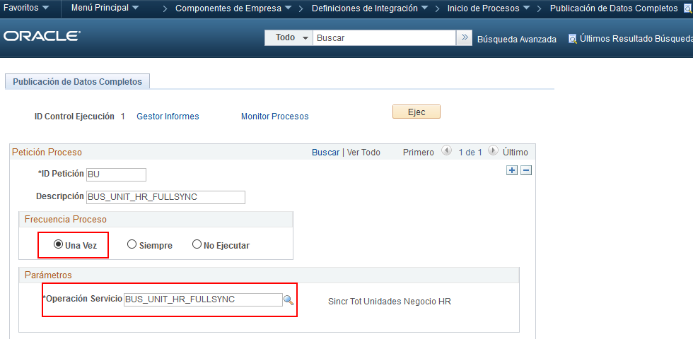

# Integration Broker - Configurar Integración full sync

## FSCM

### Configuración de servicio full sync

Peopletools 🡪 Integración con Mensajería 🡪 Configuración de Integraciones 🡪 Operaciones de Servicio

![Activar Service Operation (FSCM)][def1]
![Activar Handler (FSCM)][def2]
![Activar ruta][def3]

### Activar cola

PeopleTools 🡪 Integración con Mensajería 🡪 Monitor de Operaciones de Servicio 🡪 Administración 🡪 Estados de Cola

HR\_SETUP = Activo

---

## HCM

### Configuración de servicio full sync

Peopletools 🡪 Integración con Mensajería 🡪 Configuración de Integraciones 🡪 Operaciones de Servicio

![Activar Service Operation (HCM)][def4]
![Activar ruta][def5]

### Excluir token

PeopleTools 🡪 Integración con Mensajería 🡪 Configuración 🡪 Configuración de Servicios

![Excluir][def6]

---

### Configuración de sincronización

Componentes de Empresa 🡪 Definiciones de Integración 🡪 Reglas Publicación Datos Cmpl

![Activar reglas de publicación][def7]
![Mapa de registros][def8]
![Idioma asociado][def9]

## Ejecutar la sincronización

[def1]: ./images/fullsync/image6.png
[def2]: ./images/fullsync/image8.png
[def3]: ./images/fullsync/image7.png
[def4]: ./images/fullsync/image10.png
[def5]: ./images/fullsync/image9.png
[def6]: ./images/fullsync/image2.png
[def7]: ./images/fullsync/image1.png
[def8]: ./images/fullsync/image4.png
[def9]: ./images/fullsync/image3.png