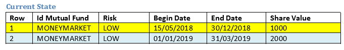

# An example of recursion using Peoplecode

Maybe recursion is not the most used method in a Peoplesoft implementation. In fact I had only used it once.

However, Peoplecode is capable of performing recursion, so I wrote an example.

## Example:
Imagine you have an investment in a Mutual Fund. This is a chart of share value progression showing values from May 15th 2018 to Dec 30th 2018 and from Jan 1st 2019 to March 31st 2019.



Then you want to add more detail, to get a more accurate vision. It is here when we start the recursion. We have to add share values between dates.


After processing Row A, our grid should look like this and should proceed with Row B.


After processing Row B, line 3 is splitted and a Row B is inserted.


Then last row is evaluated


## Algorithm:

As a I am not an English native speaker, my explanation could be a little weird/inaccurate, so I decided to paste my pseudocode. It is Peoplecode-esque but you can use it in other language that handles objects and recursion.

## Pseudocode:

###Preconditions:

- Rowsets must be sorted by date.
- End Date must exists in every row. Can not be empty.

_Mutual Funds_ class could be like this

```
App Package MUTUAL_FUND:
>> Class MutualFund
Properties:
    * ID FONDO MUTUO
    * Risk
    * BeginDate
    * EndDate
    * ShareAmt
Methods:
    getBeginDate()
    getEndDate()
    getShareAmt
```

The _splitDates()_ function or method.
```
function splitDates(ArrayFund of MUTUAL_FUND:MutualFund, oMutualFund, oNewMutualFund)
    /* oMutualFund = current row of original Mutual Fund */
    /* oNewMutuallFund = new row of Mutual Fund */
    /*

    Local MUTUAL_FUND:MutualFund &oInsMutualFund;

    /*  Scenario: dates don not overlap
        Current Row: Start Date 21/11/2018 - End Date: 30/12/2018
        New Row: Start Date 30/10/2018 - End Date : 20/11/2018
    */    
    if oMutualFund.getBeginDate() > oNewMutualFund.getEndDate() then
        ArrayFund.Push(oNewMutualFund)
    else    
        if oMutualFund.getBeginDate() = oNewMutualFund.getBeginDate then
            /*  Scenario: both beginning dates are the same or new row
                date range is wider than current row date range
                Current Row: Start Date 21/11/2018 - End Date: 22/11/2018
                New Row: Start Date 21/11/2018 - End Date : 23/11/2018
            */
            if oMutualFund.getEndDate() <= oNewMutualFund.getEndDate then
                oMutualFund = oNewMutualFund
                /* ends here */
            else
                /* Scenario:
                    Current Row: Start Date 21/11/2018 - End Date: 23/11/2018
                    New Row: Start Date 21/11/2018 - End Date : 22/11/2018
                */
                if oMutualFund.getEndDate() > oNewMutualFund.getEndDate then
                
                    Create oInsMutualFund with new dates and previous ShareAmt
                    oInsMutualFund.BeginDate = oNewMutualFund.getEndDate + 1    /* 23/11/2018 */
                    oInsMutualFund.EndDate = oMutualFund.getEndDate            /* 23/11/2018 */
                    oInsMutualFund.ShareAmt = oMutualFund.getShareAmt
                    ArrayFund.Push(oInsMutualFund)
                    
                    oMutualFund = oNewMutualFund
                end-if;
        else
            /* Start Date 15/05/2018 - Start Date 01/11/2018 */    
            if oMutualFund.getBeginDate() < oNewMutualFund.getBeginDate() then
                /* End Date 30/12/2018 - End Date 20/11/2018 */
                if oMutualFund.getEndDate() > oNewMutualFund.getEndDate() then
                    Create oInsMutualFund
                    oInsMutualFund.BeginDate = oNewMutualFund.getBeginDate()     /* 01/11/2018 */
                    oInsMutualFund.EndDate = oMutualFund.getEndDate()            /* 30/12/2018 */
                    oInsMutualFund.ShareAmt = oMutualFund.getShareAmt
                    ArrayFund.Push(oInsMutualFund)
                    
                    oMutualFund.BeginDate remains unchanged                        /* 15/05/2018 */
                    oMutualFund.EndDate = oNewMutualFund.getBeginDate - 1 day    /* 31/10/2018 */
                    oMutualFund.ShareAmt remains unchanged
                    
                    Split(ArrayFund, oInsMutualFund, oNewMutualFund)
                else
                    if oMutualFund.getEndDate() = oNewMutualFund.getEndDate() then
                        oMutualFund.BeginDate remains unchanged
                        oMutualFund.EndDate = oMutualFund.getEndDate - 1 day
                        oMutualFund.ShareAmt remains unchanged
                        
                        ArrayFund.Push(oNewMutualFund)
                    end-if;
                end-if;
            else
                /* Start Date 01/11/2018 - Start Date 30/10/2018 */
                if oMutualFund.getBeginDate() > oNewMutualFund.getBeginDate() then
                    /* End Date 30/12/2018 - End Date 20/11/2018 */
                    if oMutualFund.getEndDate() > oNewMutualFund.getEndDate() then
                        creo oInsMutualFund
                        oInsMutualFund.BeginDate = oNewMutualFund.getEndDate()   /* 20/11/2018 */
                        oInsMutualFund.EndDate = oMutualFund.getEndDate()         /* 30/12/2018 */
                        
                        ArrayFund.Push(oInsMutualFund)
                        
                        oMutualFund.BeginDate = oNewMutualFund.getBeginDate    /* 30/10/2018 */
                        oMutualFund.EndDate = oNewMutualFund.getEndDate() - 1  /* 19/11/2018 */
                        oMutualFund.ShareAmt = oNewMutualFund.getShareAmt()
                    else
                        /* End Date 29/11/2018 - End Date 30/11/2018 */
                        /* When the row includes the current row  */
                        if oMutualFund.getEndDate() < oNewMutualFund.getEndDate() then
                            oMutualFund = oNewMutualFund
                        end-if;
                    end-if;
                end-if;
            end-if;
        end-if;
    end-if;
```

The results will be put in an array and then data can extracted and saved in a rowset.

```
/* Create an instance of MUTUAL_FUND:MutualFund and put in an array of MUTUAL_FUND:MutualFund */

oCurrentObject = create MUTUAL_FUND:MutualFund()
arrayFunds[1] = oCurrentObject;

/* Create a rowset that contains rows A, B, C called rowsToBeInserted */

For 1 to rowsToBeInserted.ActiveRowCount
   
    oNewMutualFund  ​= create MUTUAL_FUND:MutualFund()
    /* assign all row data to oNewMutualFund and then call splitDates */
   
    Split(arrayFunds, oCurrentObject, oNewMutualFund)

End-For;
```