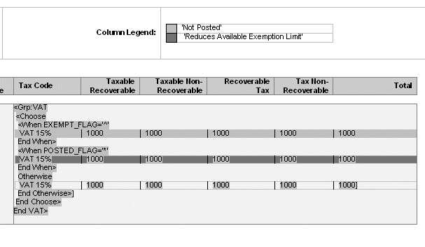

# Condicionales


## Uso del IF

__Sintaxis xdofx__
```xslt
<?xdofx:if AMOUNT > 1000 then 'Higher'
else
if AMOUNT < 1000 then 'Lower'
else
'Equal'
end if?>
```

__Sintaxis xslt__
```xslt
<?if:xdoxslt:get_variable($_XDOCTX, 'x00') != 0?>
        <?xdoxslt:get_variable($_XDOCTX, 'x00')?>
<?end if?>
<?if: (xdoxslt:get_variable($_XDOCTX, 'x00') = 0) ?>-<?end if?>
```

### Obtener una variable segun una condición
```xslt
<?if:current-group()/fld_QQ_CATEG_RUBRO='SI'?>
<?xdoxslt:set_variable($_XDOCTX, 'VarSi', xdoxslt:get_variable($_XDOCTX, 'TotalCol'))?>
<?end-if?>
```

### Evitar un retorno de carro en un un IF

_Sentencia original:_
```xslt
<?if:number(CHANGEORDERNUMBER)!=0?>
```

_Cambiar a:_
```xslt
<?if@inlines:number(CHANGEORDERNUMBER)!=0?>
```

## Uso de IF-THEN-ELSE

__Sintaxis:__
```xslt
<?xdoxslt:ifelse(condition,true,false)?>
<?xdofx: if IND=1 then 'N/A' else if IND=2 then '' else FLAG end if?>
    <?choose:?>
        <?when:IND=1?>'N/A'<?end when?>
        <?when:IND=2?><?end when?>
        <?otherwise:?><?FLAG?><?end otherwise?>
    <?end choose?>
```

_Ejemplo:_
```xslt
<?xdoxslt:ifelse(BUDGET!=0,xdoxslt:div(ACTUAL,BUDGET),'-')?>
```

## Insertando _Choose_

```xslt
<?choose:?>
<?when:expression?>
<?otherwise?>
```

Ejemplo gráfico.



| Default Text Entry in Example Form Field | Help Text Entry in Form Field |
| --- | --- |
| <Grp:VAT | <?for-each:G\_VAT?> starts the G\_VAT group |
| <Choose | <?choose:?> opens the choose statement |
| <When EXEMPT\_FLAG='^' |  <?when: EXEMPT\_FLAG='^'?> tests the EXEMPT\_FLAG element, if true, use the first table shown |
| End When> | <?end when?> ends the EXEMPT\_FLAG test |
| <When POSTED\_FLAG='\*' | <?when:POSTED\_FLAG='\*'?> tests the POSTED\_FLAG element, if true, use the table following |
| End When> | <?end when?> ends the POSTED\_FLAG test |
| Otherwise | <?otherwise:?> If none of above are true then use the following table |
| End Otherwise> | <?end otherwise?> ends the otherwise statement |
| End Choose> | <?end choose?> ends the choose statement |
| End Vat>| <?end for-each?> ends the G\_VAT group |

[Fuente: Oracle](https://docs.oracle.com/middleware/12212/bip/BIPRD/GUID-04477E49-F671-4BF1-8353-06A7CDEAD2CC.htm#BIPRD2480)